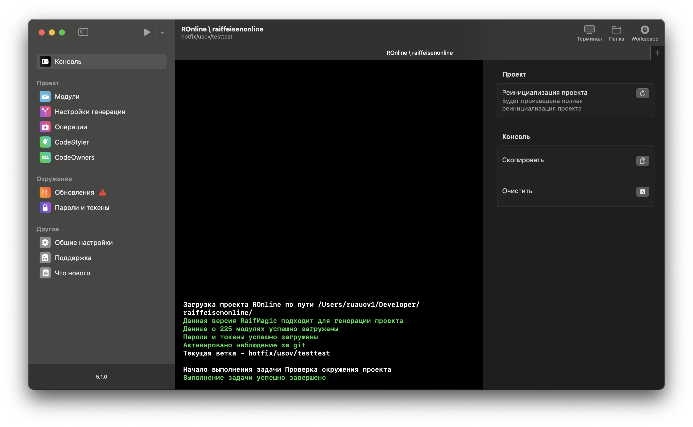

# RaifMagic

Use RaifMagic to manage your own iOS project.  


### Key Features

- Project generation based on a defined scenario (e.g., `pod install`, `tuist generate`, etc.). You can define your own custom generation scenario.
- CodeStyler system for managing code formatting (+ CI plugin).
- CodeOwners system for managing code ownership (+ CI plugin).
- Environment control and updates. You can define custom environment elements to be downloaded/updated.
- One-click execution of common operations (e.g., cache cleaning, pod installation, etc.). Operations are project-specific.
- Password and token management.
- Auto-update of RaifMagic.
- Built-in colored console.
- Ability to create custom screens as part of your project integration.

And much more.

### Integration into Your Own Project

To test the integration in your project, create a `.magic.json` file in the root of your repository with the following content:

```json
{
  "project_id": "Example",
  "minimal_raif_magic_version": "5.0.0"
}
```

Then, drag and drop the project folder into the RaifMagic window to start working. At this stage, mock/test data will be displayed. For full support with your own project, you need to implement an integration.

The project already contains a test integration you can use as a reference. You can find it in the `SupportedProjects` folder. During integration, you can fine-tune which features are needed—for example, disabling CodeStyler or any other screen if not required.

Here are some important notes:

- The `project_id` value in `.magic.json` must match the `projectID` property of the struct conforming to the `IProject` protocol in your integration.
- The integration is heavily protocol-oriented. By conforming your service to a specific protocol, a corresponding UI section becomes available. For instance, conforming to `CodeStylerSupported` enables CodeStyler support for your project. If a feature is not needed, simply remove the protocol conformance.
- The `minimal_raif_magic_version` key defines the minimum RaifMagic version required to work with your project. If the running RaifMagic’s major version differs from the one specified, generation is blocked until RaifMagic is updated to the specified version or any higher one within the same major version.

When dragging a new folder into RaifMagic, the app automatically checks for supported projects.

### General Info

RaifMagic uses a temporary folder `~/raifMagic` to store logs. It may also be used for environment elements or any other internal logic.

## URL Scheme and Deeplinks

RaifMagic is registered with the URL scheme `raifmagic://`. To open it from the terminal, type `open raifmagic://`.

Available schemes:

- `raifmagic://` – Opens RaifMagic using its default logic (if only one project is added, it will be opened).
- `raifmagic://projectsList` – Opens the list of added projects.
- `raifmagic://project/{{_path_to_project_}}` – Opens the project located at the specified path. The folder must contain a `.magic.json` file.
- `raifmagic://project/{{_path_to_project_}}/{{screen_id_and_parameters}}` – Opens the project at the specified path with the specified screen and parameters.

### List of Available Screens

Using deeplinks, you can open any screen in RaifMagic, including custom screens added via the `CustomScreenSupported` protocol in your project service. By default, the following screens are available (if the corresponding protocol is implemented in the integration):

- `/console` – Console
- `/modules` – List of modules
- `/generation-settings` – Generation settings
- `/operations` – Project operations
- `/code-styler` – CodeStyler without port for data exchange
- `/code-styler/open-cf-port/port-id` – CodeStyler with an open port for data exchange
- `/environment` – Environment
- `/environment/version-manager` – Available versions of RaifMagic
- `/secrets` – Passwords and tokens
- `/settings` – Settings
- `/support` – Support
- `/whats-new` – What's new